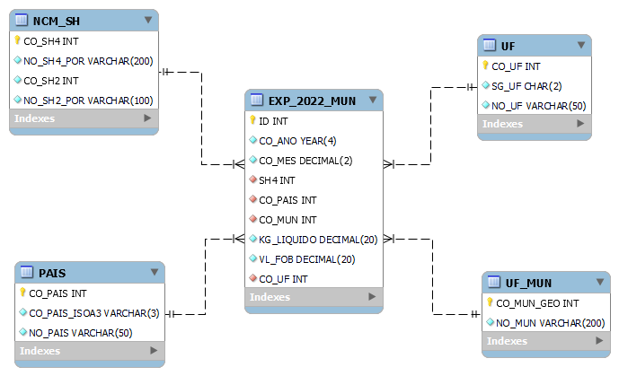
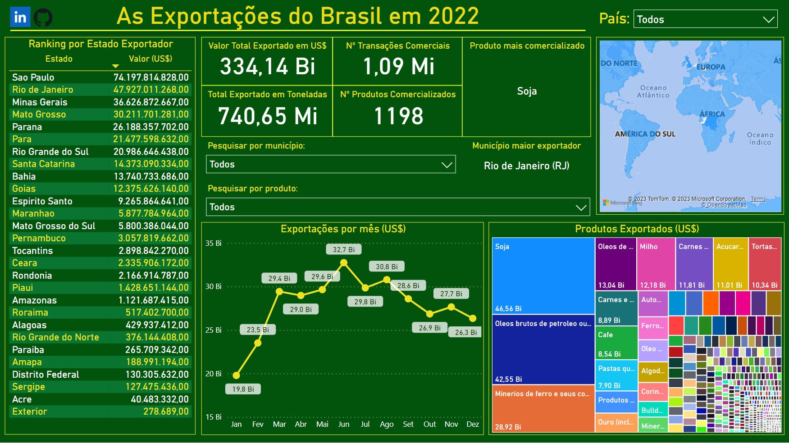

# As Exportações do Brasil em 2022

## Introdução

Neste projeto tive como objetivo analisar os dados de exportação do Brasil no ano de 2022, utilizando os dados do Ministério do Desenvolvimento, Indústria, Comércio e Serviços, disponibilizados como [Estatísticas de Comércio Exterior em Dados Abertos](https://www.gov.br/produtividade-e-comercio-exterior/pt-br/assuntos/comercio-exterior/estatisticas/base-de-dados-bruta#Municipio), que por sinal, são muito bem organizados, completos e fáceis de acessar e baixar. A base de dados detalhada por Município da empresa exportadora/importadora e Posição do Sistema Harmonizado (SH4) foi explorada e processada para obter diversos insights significativos.

## Etapas do Projeto

### Preparação dos Dados (Python - Jupyter Notebook)

Os dados brutos foram baixados das Estatísticas de Comércio Exterior em Dados Abertos.
Realizou-se o tratamento e a limpeza dos dados, incluindo todas as correções necessárias para a correta importação dos dados para um banco de dados SQL.
Foram realizadas análises exploratórias para compreender melhor a estrutura dos dados e os tipos de estatísticas possíveis de serem extraídas.

[Acessar Código Python](Exportação_Brasil_2022.ipynb)

### Modelagem e Importação de Dados (MySQL)

Foi criado um modelo de dados no MySQL Workbench com base nas necessidades do projeto.
O diagrama de entidade-relacionamento (ER) foi desenvolvido para representar a estrutura do banco de dados. Como ilustrado a seguir:

Pelo MySQL Workbench, com o diagrama criado, foi possível gerar o código SQL para criar todas as tabelas, índices e relacionamentos necessários, sendo feitas as devidas correções para evitar erros. Junto disso, os dados tratados no Python foram importados para o banco de dados MySQL. Código descrito a seguir:

[Acessar Código SQL](codigo_diagrama_format.sql)

### Desenvolvimento do Dashboard (Microsoft Power BI)

Um dashboard interativo foi criado no Microsoft Power BI para explorar os dados de exportação.

Foram incluídas segmentações de dados para selecionar por país, para se ter uma total noção de como cada país se comporta comercialmente em relação ao Brasil, com o total exportado em US$, número de transações comerciais, total exportado em toneladas, número de produtos diferentes comercializados, produto mais exportado e município com maior valor exportado.
Um ranking de exportações por estado brasileiro em total US$ foi incorporado, e é permitindo também a seleção de exportações por município e produto.
Gráficos de linha do tempo das exportações totais em US$ por mês de 2022, treemaps dos produtos e mapas interativos também foram incluídos.

## Resultados e Insights

[Acessar Dashboard Microsoft PowerBI](https://app.powerbi.com/view?r=eyJrIjoiYjRmNTYyOGUtYjNlYy00YzEyLWIwODYtZDExYTVlNWFiNzM3IiwidCI6IjgxODRlODBmLWYxNWUtNGJiMC1hNTk0LWZiMDgyMWMwNTM5ZSJ9)

#### Os resultados da análise permitem revelar os principais países de destino das exportações brasileiras em 2022, bem como os produtos mais exportados.
#### A segmentação por país revela como cada um se comporta comercialmente e revela tendências do que cada país mais compra daqui, servindo como guia para empresas de cada setor de onde se pode buscar maior abertura de mercado e onde determinados produtos são mais procurados e comercializados.
#### O ranking de exportações por estado brasileiro demonstra a força produtiva de cada unidade federativa e sua importância comercial para o país, mostrando as relações comerciais dos nossos estados com cada país do mundo.
#### O gráfico de linha do tempo destacou padrões sazonais nas exportações ao longo do ano para cada país, produto ou mesmo município.
#### O treemap fornece uma visão bastante clara dos produtos que cada país importa daqui com maior quantidade e valor.
#### Com a segmentação de produto, tem-se todos os dados em valores totais e absolutos de como aquele determinado produto se comportou comercialmente durante o ano, além de indicar tendências do mesmo para o futuro.

## Conclusão

Este projeto demonstra a capacidade de adquirir, processar e analisar dados de exportação do Brasil em 2022, desde a limpeza inicial dos dados até a criação de um dashboard interativo no Microsoft Power BI. As análises realizadas forneceram informações valiosas sobre as exportações brasileiras, seus principais mercados e produtos. O conhecimento adquirido pode ser usado para orientar estratégias de exportação e tomada de decisões comerciais por empresas de todos setores, bem como uma análise geral do panorama de exportações do nosso país.
