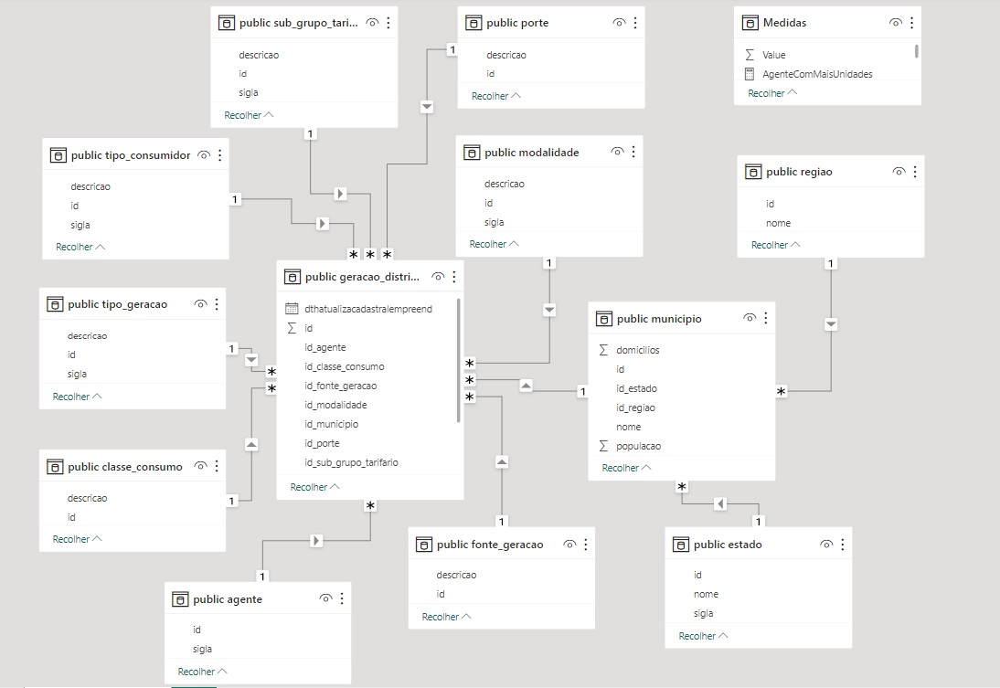
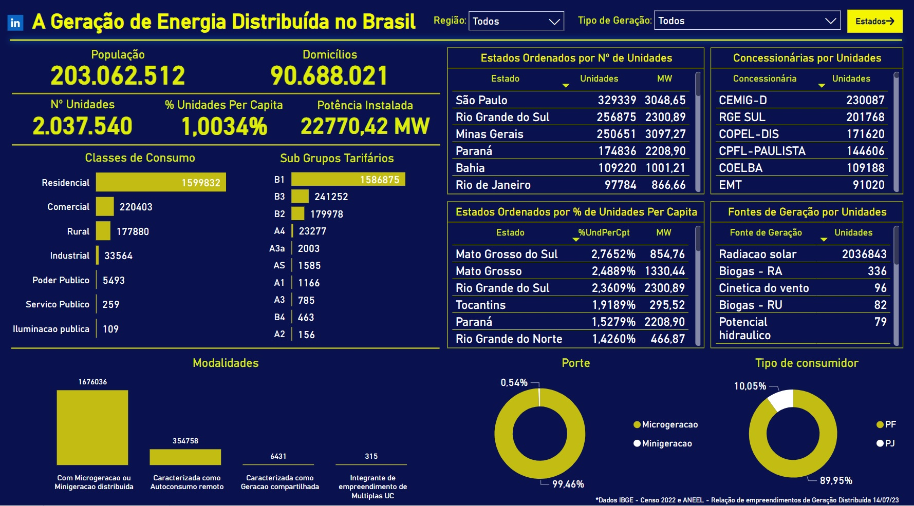
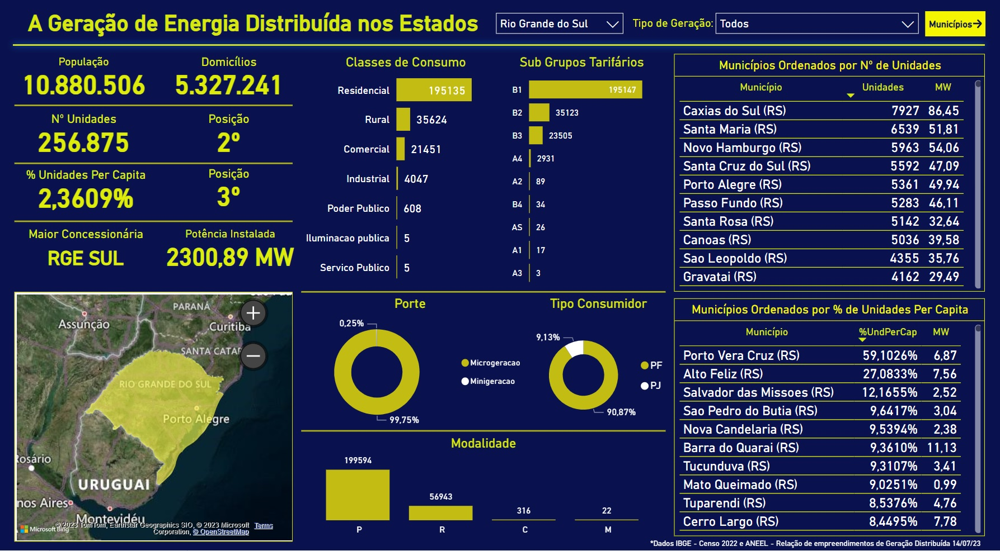
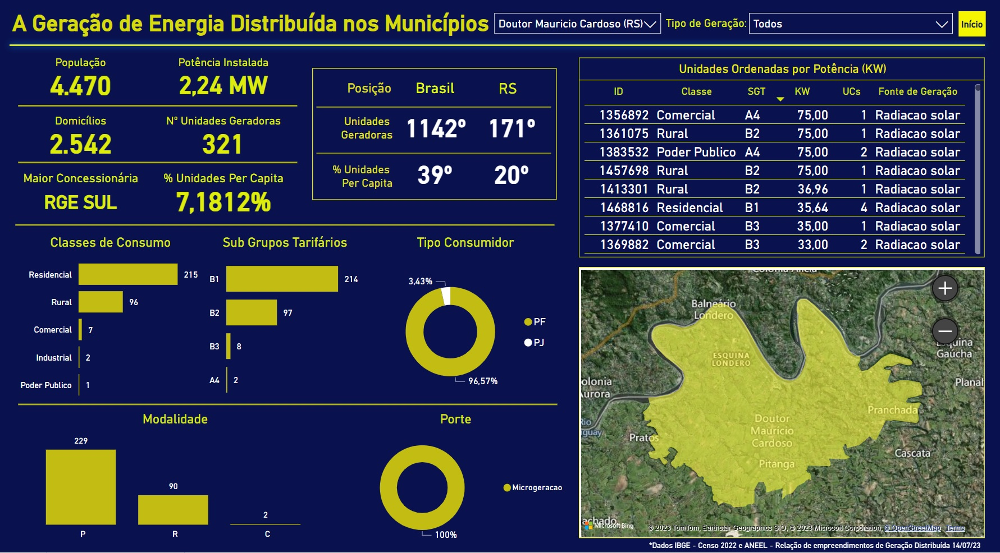

# A Geração de Energia Distribuída no Brasil

## Introdução

Como engenheiro civil, e tendo trabalhado no passado em uma empresa que fornece soluções em energias renováveis, com destaque para a energia solar, onde trabalhei na parte comercial e técnica, e agora estando na área da Ciência e Análise de Dados, resolvi dar partida ao meu portfólio de dados com este projeto, que tem como objetivo analisar e visualizar os dados de energia distribuída no Brasil, incluindo energia solar, eólica, hidrelétrica e termelétrica e demais fontes a partir da tabela da [Agência Nacional de Energia Elétrica (ANEEL)](https://dadosabertos.aneel.gov.br/pt_BR/dataset/relacao-de-empreendimentos-de-geracao-distribuida/resource/b1bd71e7-d0ad-4214-9053-cbd58e9564a7), que lista todas as unidades de energia distribuída no país no dia 14/07/23. Fiz então o cruzamento destes dados com o censo de 2022 do [Instituto Brasileiro de Geografia e Estatística (IBGE)](https://www.ibge.gov.br/estatisticas/sociais/populacao/22827-censo-demografico-2022.html?edicao=37225&t=resultados), com as informações sobre a população e os domicílios dos municípios brasileiros para obter dados de quanto as energias renováveis já estão inseridas em todos o contexto das cidades e população brasileiras. A partir deste estudo obtive diversos resultados interessantes, que serão descritos a seguir.

## Etapas do Projeto

O projeto foi desenvolvido em três etapas principais, com três ferramentas distintas e complementares para o objetivo proposto.

- Preparação, Limpeza e Tratamento dos Dados na Linguagem Python (Jupyter Notebook):

Inicialmente, foram carregadas as bibliotecas necessárias, o Pandas, o Unidecode e o Psycopg2. Então os dados da ANEEL e do IBGE* foram importados e foram realizadas as etapas de limpeza, tratamento e transformação dos dados, incluindo a correção de valores ausentes e a padronização dos formatos de dados. 

[Acessar Código Python](Dados_energia_distribuida_Aneel_IBGE_format.ipynb)

*A tabela importada do IBGE foi feita no Excel a partir das tabelas [2.1 - População residente](Tabela_21.xlsx), e [1.1 - Domicílios Recenseados](Tabela_11.xlsx), resultando na [Tabela_Populacao_Domicilio_IBGE_format](Tabela_Populacao_Domicilio_IBGE_format.xlsx)

- Análise e Modelagem de Dados no PostgreSQL

Em seguida, os dados preparados foram armazenados em um banco de dados PostgreSQL, permitindo realizar consultas e análises mais complexas. Foram utilizadas consultas SQL para extrair informações específicas e criar tabelas de agregação e toda a modelagem dos dados realizada para permitir as visualizações posteriormente no Power BI.

[Acessar Código SQL](Modelagem_dados_energia.sql)

- Criação de Dashboards no Power BI

Por fim, os dados foram importados do PostgreSQL para o Power BI, onde foram criados diversos dashboards e visualizações interativas. Utilizando gráficos, tabelas e mapas, exploramos as principais tendências e padrões relacionados à energia distribuída no Brasil.

Na aba de exibição de modelo podemos visualizar bem como ficou o relacionamento entre as tabelas:

A apresentação foi divida em 3 níveis, nacional, estadual e municipal:

No primeiro nível, temos uma visão mais ampla da situação da energia distribuída no país, onde os dados podem ser filtrados por região brasileira, bem como por tipo de geração de energia, além de todas as interações nos gráficos e também tabelas ordenando estados, seja por número de unidades, como por unidades per capita, além de rankin de maiores concessionárias e maiores fontes de energia.

No segundo nível, temos a visão por estado, podendo ser filtrado também por tipo de geração de energia, demonstrando como cada unidade federativa está em relação as outras, bem como outras informações e gráficos específicos, mapa e tabelas rankeando os municípios do estado por número de unidades e por unidades per capita.

Exemplo: Rio Grande do Sul, meu estado natal.

No último nível, temos a visão por município, demonstrando a situação do mesmo em relação aos outros municípios do estado e também do Brasil, bem como informações e gráficos, além de mapa e tabela com as maiores unidades rankeadas por potência de geração (KW).

Exemplo: Doutor Maurício Cardoso, minha cidade natal.

##Resultados e Insights

[Acessar Dashboards Microsoft PowerBI](https://app.powerbi.com/view?r=eyJrIjoiMzc4YWZiZDctZWRmYS00OWU1LTg5NTctOGM5N2IxZjM4MTIyIiwidCI6IjgxODRlODBmLWYxNWUtNGJiMC1hNTk0LWZiMDgyMWMwNTM5ZSJ9)

Com as visualizações criadas no Power BI, pudemos obter diversos insights relevantes sobre a geração de energia distribuída no Brasil. Alguns dos principais resultados incluíram:

-Distribuição geográfica das unidades de energia por estado e município.

-Análise da correlação entre a quantidade de unidades de energia solar e a população de cada estado e município.

-Identificação das regiões e estados do Brasil com maior adesão à energia solar e demais tipos de energia renovável.

-Grande potencial de crescimento de uso energias renováveis em todo Brasil.

##Conclusão

Este projeto demonstra o potencial e a importância das energias renováveis no Brasil, com destaque para a energia solar, fornecendo informações valiosas para o setor. As visualizações interativas criadas no Power BI facilitam a análise e interpretação dos dados, permitindo tomadas de decisão mais fundamentadas e contribuindo para o desenvolvimento sustentável do país, bem como sendo também uma ótima ferramenta de análise para empresas, profissionais e entusiastas da área, permitindo diversas análises interessantes, como das áreas mais desenvolvidas no setor bem como o reconhecimento de locais onde as energias renováveis ainda tem pouca adesão e dessa forma imenso potencial de crescimento.

Palavras-chave: Energia Solar, ANEEL, IBGE, PostgreSQL, Power BI, Energia Renovável, Análise de Dados, Ciência de Dados.

##Referências:

[Dicionário de dados abertos ANEEL](dm-geracao-distribuida-relacao-de-empreendimentos.pdf)
